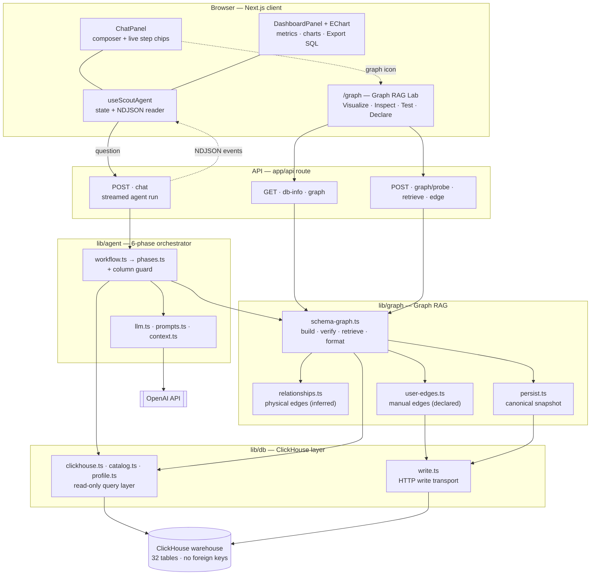
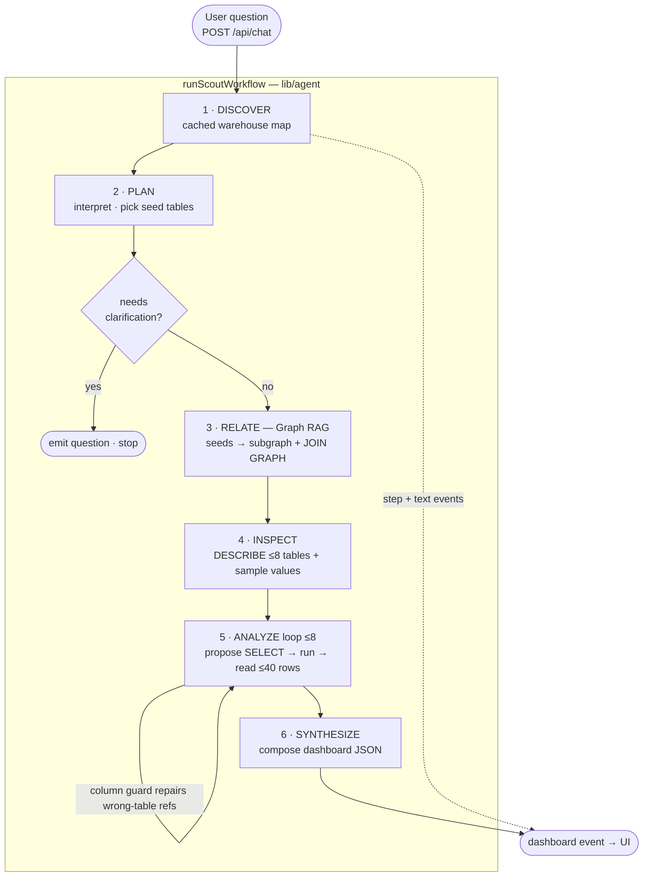
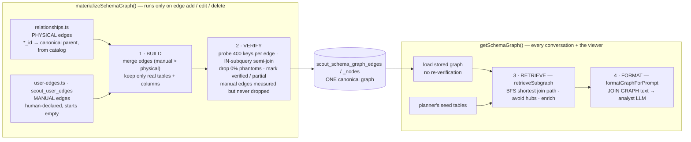

# Scout - AI Data Analytics Agent over ClickHouse

Scout turns a question into a structured analytical dashboard by reasoning over a
large ClickHouse warehouse the way an analyst would: **map the schema, work out which tables join
and on what keys, write the SQL, run it, and explain the result** all at runtime, streamed live.

```text
 Question ──▶ POST /api/chat ──▶  DISCOVER → PLAN → RELATE → INSPECT → ANALYZE↺ → SYNTHESIZE
   (NL)         (NDJSON stream)                   └── Graph RAG: seeds → connected subgraph + exact join keys
                     │
                     ├──▶ Chat panel .......... live reasoning chips + narrative
                     └──▶ Dashboard panel ..... hero metrics · ECharts · insights · Export SQL
```

---

## Quickstart

```bash
# 1 · configure — copy the template and fill in OpenAI + ClickHouse credentials
cp .env.example .env

# 2 · install
npm install

# 3 · build the demo warehouse (idempotent; creates the 32 no-FK banking tables)
npm run db:seed-graph

# 4 · run
npm run dev          # → http://localhost:3000
```

Environment (`.env`):

| Variable                                                                              | Purpose                                               |
| ------------------------------------------------------------------------------------- | ----------------------------------------------------- |
| `OPENAI_API_KEY`                                                                      | LLM reasoning for the planner / analyst / synthesizer |
| `OPENAI_MODEL`                                                                        | agent model (default `gpt-4o`)                        |
| `CLICKHOUSE_HOST` / `CLICKHOUSE_USER` / `CLICKHOUSE_PASSWORD` / `CLICKHOUSE_DATABASE` | the warehouse Scout queries (read-only)               |

Scout connects to a warehouse that already exists. Point it at your
own ClickHouse, or run `npm run db:seed-graph` to generate the demo one.

---

## Architecture

Three library layers — **`agent` / `graph` / `db`** - sit behind a single streaming API. The UI
imports only `lib/types.ts`; each layer talks only to the one below it.



**Request lifecycle** —-the six phases and the bounded analyze loop:



---

## 1 · The problem this solves

The warehouse models a card-issuer / retail bank in **32 interconnected tables (~7.3M rows)** and,
by design, has **no foreign keys**. Tables are linked only by _shared key columns_ and some of
those keys are **aliased**, so a column-name match alone can't even find them:

| Child column                       | actually joins | Parent column             |
| ---------------------------------- | -------------- | ------------------------- |
| `loan_book.branch`                 | →              | `branches.branch_id`      |
| `collections.assigned_employee_id` | →              | `employees.employee_id`   |
| `card_transactions.merchant`       | →              | `merchants.merchant_name` |

A shared _name_, meanwhile, doesn't prove a join either: `account_transactions.txn_id` and
`card_transactions.txn_id` share a name but have **zero** overlapping values. Scout has to tell the
real relationships from the coincidental ones from the data, not the schema.

## 2 · The warehouse

32 tables across eight sub-domains, linked by shared (often aliased) keys — never by FKs:

| Sub-domain         | Tables                                                                                                   |
| ------------------ | -------------------------------------------------------------------------------------------------------- |
| Customer           | `customers`, `geographies`, `devices`                                                                    |
| Branch & staff     | `branches`, `employees`                                                                                  |
| Accounts & cards   | `accounts`, `cards`, `card_products`, `card_applications`, `account_transactions`                        |
| Payments & rewards | `card_transactions`, `statements`, `rewards_ledger`, `reward_redemptions`, `offers`, `offer_redemptions` |
| Lending            | `loan_book`, `loan_products`, `loan_applications`, `loan_repayments`, `collections`, `credit_bureau`     |
| Risk & compliance  | `disputes`, `fraud_alerts`, `kyc_records`, `aml_screenings`                                              |
| Merchants          | `merchants`, `merchant_categories`                                                                       |
| Engagement         | `app_sessions`, `support_tickets`, `marketing_campaigns`, `campaign_responses`                           |

---

## 3 · Graph RAG, in detail

Classic RAG retrieves relevant _documents_. **Graph RAG retrieves a relevant _subgraph_** - the
nodes _and_ the relationships between them. Scout's knowledge graph is the **schema graph**: tables
are nodes, recovered join keys are edges. The engine is
[`lib/graph/schema-graph.ts`](lib/graph/schema-graph.ts) +
[`lib/graph/relationships.ts`](lib/graph/relationships.ts).

The expensive part - assembling every candidate edge
and probing each one against the live data runs **once** and is stored as a single canonical
graph. Every conversation and the in-app viewer then **read** that stored graph; they never
re-verify. Verification only re-runs when a human changes the graph in the Lab.



### 3.1 Two kinds of edge

The graph has no FK metadata to start from, so every edge comes from one of two sources surfaced
in the UI as its **connection** kind:

- **Physical** _(inferred)_ - recovered purely from the catalog: any key-like column (`*_id`, or a
  known join column in `PARENT_OF_COLUMN`) that exists both on a table and on its **canonical
  parent** becomes an edge. Zero configuration, recomputed from the live schema, so it stays correct
  as tables change. This is the automatic backbone of the graph.
- **Manual** _(declared)_ - human-asserted edges managed in the **Graph RAG Lab** and stored in
  `scout_user_edges`. The store **starts empty**, you declare the edges inference can't see -
  the **aliased** keys (`card_transactions.merchant → merchants.merchant_name`) and they become
  first-class, editable join keys. Manual is authoritative: on conflict it **wins over** physical.

`buildSchemaGraph()` merges both and requires every edge to exist in the live catalog.

### 3.2 Verify - drop phantom joins against live data

A shared column name doesn't prove a join, so `verifyEdges()` **measures** each edge: it samples the
child key (400 distinct values) and counts the fraction that actually resolve to the parent, using
an `IN (subquery)` **semi-join** (not a `LEFT JOIN`, which ClickHouse fills with type defaults and
would make every edge look like a 100% match).

- **0% overlap → dropped** as a confirmed phantom (kept aside for inspection, never traversed).
- **≥ 50% → `verified`**; anything in between is flagged **`partial`** so the analyst is warned the
  join is lossy.
- The count is **auditable** — `measureOverlap` returns the exact `matched` / `sampled` behind the
  percentage, surfaced in the Lab.
- It **fails open**: a probe timeout leaves an edge un-judged rather than dropping a possibly-real
  key. **Manual** edges are measured the same way but **never dropped** — a human asserted them; a
  lossy one is still flagged partial.

The verified graph is persisted by [`lib/graph/persist.ts`](lib/graph/persist.ts) to
`scout_schema_graph_edges` / `_nodes` as **exactly one** snapshot (each materialization writes a
fresh `built_at` and prunes the older one). `loadStoredGraph()` reads it straight back — that's what
`getSchemaGraph()` serves, so the build/verify cost is paid once, not per question.

### 3.3 Retrieve - `retrieveSubgraph()`

Given the **seed tables** the planner picked, it returns the connected subgraph
plus the exact join map:

1. **Keep the seeds.**
2. **Connect them** - for each remaining seed, find the shortest **join path** (fewest hops) to the
   already-included set with a breadth-first search, pulling in the **bridge tables** along the way.
   (A question spanning `customers` + `branches` automatically pulls in `accounts`.) Hub columns
   (`customer_id`, `city`) are avoided first, so two unrelated tables aren't bridged just because
   both carry a hub column.
3. **Enrich** - fill the remaining budget (default 8 tables) with the seeds' direct neighbours,
   **verified edges first** (typically the dimension tables).

### 3.4 Inject - and repair the analyst's SQL

- `formatGraphForPrompt()` renders the subgraph as a **`JOIN GRAPH`** block of
  `tableA.colA = tableB.colB` lines, fed to the Analyst LLM with an instruction to join **only** on
  these recovered keys (partial edges flagged as lossy).
- The graph is **load-bearing at query time**, not just for retrieval. Because there are no FKs, the
  analyst sometimes references a column on a table that doesn't own it. `checkColumns()` (pre-flight)
  and `enrichError()` (on a ClickHouse error) use the subgraph to tell it _which table owns the
  column and the exact join key to reach it_ so the retry is grounded, not another guess.
  `enrichError()` also catches an **unknown-table** reference (a name the model invented): it names
  the real tables and the closest match, so the agent reports clearly instead of failing cryptically.

### 3.5 The Graph RAG Lab (`/graph`)

- **Visualize** - the schema graph as nodes (tables, coloured by sub-domain) and edges (verified /
  partial / physical / manual).
- **Inspect** - every recovered edge with its **connection** (physical / manual), live value
  overlap, and verdict (verified / partial / dropped phantom), including the dropped phantoms.
- **Test** - pick seed tables and see the exact subgraph + `JOIN GRAPH` the RELATE phase would
  build, or probe any two columns for their live overlap (with exact matched / sampled counts).
- **Declare a relationship** - add, edit, or delete a **manual** edge between two related columns.
  Each change is verified against live data, persisted to `scout_user_edges`, re-materializes the
  canonical graph, and shows up in the next question immediately.

---

## 4 · The 6-phase pipeline

Instead of one unconstrained tool-calling loop, Scout decomposes analysis into six typed phases
(orchestrated in [`lib/agent/workflow.ts`](lib/agent/workflow.ts), one function each in
[`lib/agent/phases.ts`](lib/agent/phases.ts)):

1. **DISCOVER** - map the warehouse once (cached): tables, columns, free row-count estimates.
2. **PLAN** - the Planner LLM interprets the question, fixes metric definitions, picks
   seed tables, and decides whether to ask for clarification.
3. **RELATE (Graph RAG)** - read the schema graph and walk from the seeds to the connected subgraph
   - exact join keys (Section 3). Degrades to just the seeds if the graph is unavailable.
4. **INSPECT** - fetch exact typed schemas (`DESCRIBE`) for the subgraph's tables (up to 8) and
   sample their categorical values.
5. **ANALYZE** - a bounded loop (≤ 8 queries): the Analyst LLM, armed with the `JOIN GRAPH` and the
   sampled values, proposes one SELECT, runs it, reads ≤ 40 result rows, and iterates. The
   graph-backed column guard repairs wrong-table references here.
6. **SYNTHESIZE** - the Synthesizer LLM composes the structured JSON dashboard, using exact warehouse
   facts (table / row counts) so it never guesses structural numbers.

Every phase streams its own step chip to the UI, so the user watches the reasoning live.

---

## 5 · Project structure

```text
app/
  page.tsx                    UI shell (state lives in hooks/useScoutAgent.ts)
  graph/page.tsx              Graph RAG Lab (Visualize / Inspect / Test / Declare)
  api/[[...route]]/route.ts   API router — GET db-info · graph ; POST chat · graph/probe·retrieve·edge
components/                   ChatPanel · DashboardPanel + EChart · GraphCanvas (SVG graph viewer) · icons
  components.css              hand-written component styles (the rest is Tailwind utilities)
hooks/useScoutAgent.ts        client state: turns, dashboard versions, NDJSON streaming
lib/
  types.ts                    shared contract: streaming events + dashboard shape
  agent/                      ── AGENT ──
    workflow.ts               the 6-phase orchestrator
    phases.ts                 the six phases + the graph-backed column guard + dashboard coercion
    context.ts                shared shapes (Plan / AnalyzeResult) + prompt formatters
    prompts.ts                all LLM system prompts
    llm.ts                    OpenAI client wrapper (llmJSON)
  graph/                      ── GRAPH RAG ──
    relationships.ts          physical (inferred) edges + hub/parent/domain metadata
    user-edges.ts             manual (declared) edge store — scout_user_edges
    schema-graph.ts           materialize (build → verify → persist) · get (read) · retrieve · format
    persist.ts                single canonical graph snapshot → scout_schema_graph_edges/_nodes
  db/                         ── CLICKHOUSE ──
    clickhouse.ts             read-only query layer (runSelect / describeTable)
    catalog.ts                cached warehouse catalog
    profile.ts                samples categorical column values for the analyst
    write.ts                  HTTP write transport (chExec) for the manual store + graph snapshot
scripts/                      seed_graph.mjs (build the no-FK warehouse) + inspection helpers
```
