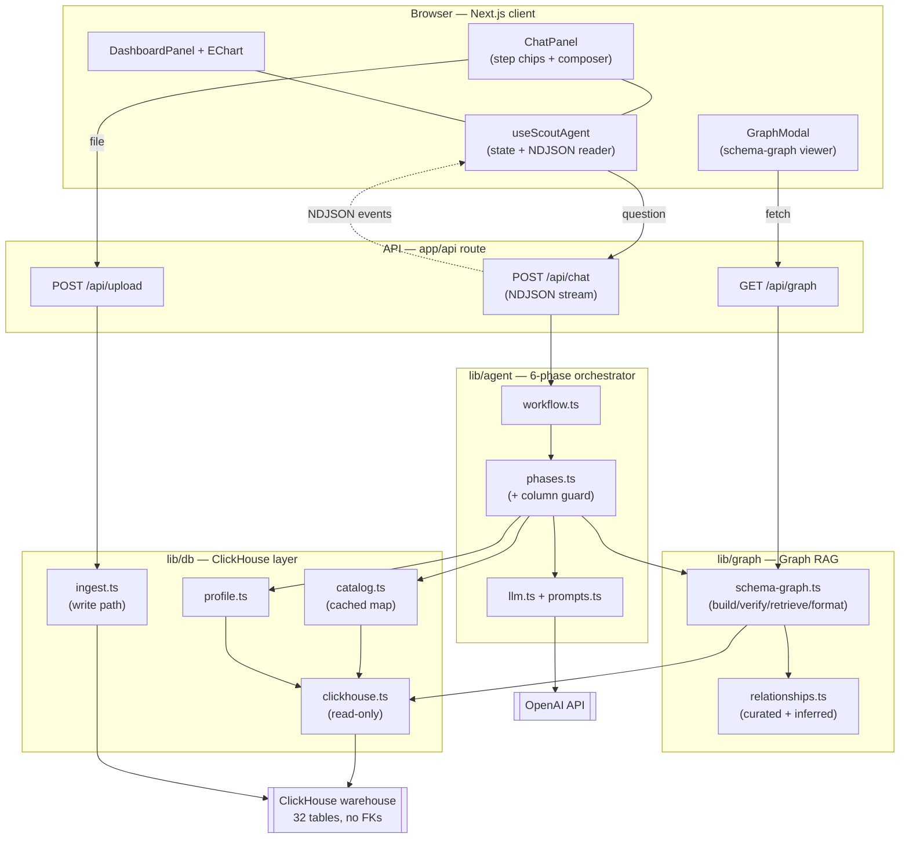
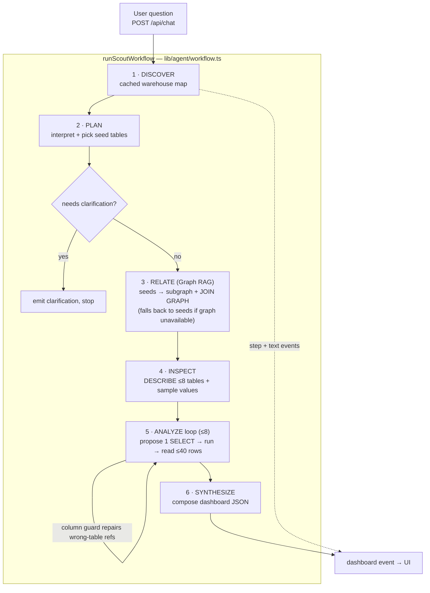
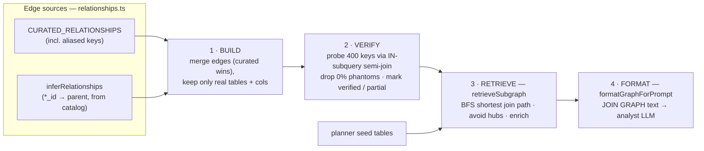

# Scout - AI Data Analytics Agent over ClickHouse

Scout turns a plain-English question into a structured analytical dashboard by reasoning over a large ClickHouse warehouse the way an analyst would:
map the schema, figure out which tables join and on what keys, write the SQL, run it,
and explain the result.

```
User question
   │  POST /api/chat  (streaming NDJSON)
   ▼
Scout pipeline    DISCOVER → PLAN → RELATE → INSPECT → ANALYZE↺ → SYNTHESIZE
   │                                └── Graph RAG: seed tables → connected subgraph + exact join keys
   ▼
Event stream  →  Chat panel (live reasoning chips + narrative)
              →  Dashboard panel (hero metrics, ECharts, insights, tables, Export SQL)
```

---

## Architecture & flow

**Agent architecture** — three library layers (`agent` / `graph` / `db`) behind a single streaming
API, with the UI importing only `lib/types.ts`:



**Program flow** — the six phases and the bounded analyze loop:



---

## 1. The problem this solves

The warehouse is **32 interconnected tables** modelling a card-issuer / retail bank (~7.3M rows),
and by design — it has no foreign keys.Tables are linked only by *shared key columns*, and some of those keys are **aliased** (`loan_book.branch` →
`branches.branch_id`, `collections.assigned_employee_id` → `employees.employee_id`), so a column-name
match alone can't even find them.

---

## 2. The warehouse

32 tables across eight sub-domains, linked by shared (often aliased) keys — never by FKs:

| Sub-domain | Tables |
|---|---|
| Customer | `customers`, `geographies`, `devices` |
| Branch & staff | `branches`, `employees` |
| Accounts & cards | `accounts`, `cards`, `card_products`, `card_applications`, `account_transactions` |
| Payments & rewards | `card_transactions`, `statements`, `rewards_ledger`, `reward_redemptions`, `offers`, `offer_redemptions` |
| Lending | `loan_book`, `loan_products`, `loan_applications`, `loan_repayments`, `collections`, `credit_bureau` |
| Risk & compliance | `disputes`, `fraud_alerts`, `kyc_records`, `aml_screenings` |
| Merchants | `merchants`, `merchant_categories` |
| Engagement | `app_sessions`, `support_tickets`, `marketing_campaigns`, `campaign_responses` |

The data is **internally consistent**, not random filler: `rewards_ledger` and `statements` are
derived from real `card_transactions`; `disputes`/`fraud_alerts` come from transactions actually
flagged `is_fraud`; `loan_repayments` is the real EMI schedule; `collections` exists only for
delinquent loans. Every row for a customer is generated from that customer's own
`value_band`/`credit_score`/`income`, so totals reconcile across tables. `npm run db:seed-graph`
builds it (idempotent).

---

## 3. Graph RAG, in detail

Classic RAG retrieves relevant *documents*. Graph RAG retrieves a relevant *subgraph* of a
knowledge graph so the model gets the nodes and the relationships between them.
Scout's knowledge graph is the **schema graph**: tables are nodes, recovered join keys are edges.
The whole engine is [`lib/graph/schema-graph.ts`](lib/graph/schema-graph.ts) +
[`lib/graph/relationships.ts`](lib/graph/relationships.ts), in four stages:



### 3.1 Build — nodes and edges

- **Nodes** - every table in the live catalog (`system.columns`), carrying its column list and a
  free row-count estimate (`buildSchemaGraph`).
- **Edges** - the implicit join keys, recovered two ways and merged:
  - **Curated manifest** (`CURATED_RELATIONSHIPS`) - authoritative, hand-declared edges. This is the
    source of truth and captures the **aliased** keys a name match can't see (e.g.
    `card_transactions.merchant` → `merchants.merchant_name`).
  - **Auto-inference** (`inferRelationships`) - recovered purely from the catalog with zero FK
    metadata: any key-like column (`*_id`, or a known join column in `PARENT_OF_COLUMN`) that exists
    both on a table and on its **canonical parent** becomes an edge. This keeps the graph correct
    when **new tables are uploaded**, and proves relationships are discoverable with no FK metadata.

  `buildSchemaGraph()` merges both (**curated wins on conflict**) and every edge must exist in the
  live catalog — both tables present, both join columns real — defending against stale curation.

### 3.2 Verify - drop phantom joins against live data

A shared column name does **not** prove two columns join. `account_transactions.txn_id` and
`card_transactions.txn_id` share a name yet have **zero** overlapping values. So `verifyEdges()`
samples each child key (400 distinct values) and measures the fraction that actually resolves to the
parent.
Edges at 0% overlap are **dropped as phantoms**; the rest are marked `verified` (≥50%) or flagged **partial** so the
analyst is warned a join is lossy.
It **fails open**: a probe timeout leaves an edge un-judged rather than dropping a possibly-real key.

### 3.3 Retrieve - `retrieveSubgraph()`

The heart of it. Given the **seed tables** the planner picked from the question, it returns the
connected subgraph plus the exact join map:

1. **Keep the seeds.**
2. **Connect them** - for each remaining seed, find the shortest **join path** (fewest hops) to the
   already included set with a breadth-first search (`bfsPath`), pulling in the **bridge tables**
   along the way. (A question spanning `customers` + `branches` automatically pulls in `accounts`.)
3. **Enrich** - fill the remaining budget (default 8 tables) with the seeds' direct neighbours,
   **verified edges first** (typically the dimension tables).
   
### 3.4 Inject - and repair the analyst's SQL

- `formatGraphForPrompt()` renders the subgraph as a **`JOIN GRAPH`** block of
  `tableA.colA = tableB.colB` lines, fed to the Analyst LLM with an instruction to join **only** on
  these recovered keys (partial edges are flagged as lossy).
- The graph is also **load-bearing at query time**, not just for retrieval. Because there are no FKs,
  the analyst sometimes references a column on a table that doesn't own it. `checkColumns()`
  (pre-flight) and `enrichColumnError()` (on a ClickHouse error) use the subgraph to tell it *which
  table owns the column and the exact join key to reach it* — so the retry is grounded instead of
  another guess.

### 3.5 Where it runs

```
DISCOVER → PLAN → [ RELATE ] → INSPECT → ANALYZE↺ → SYNTHESIZE
                      └── walks the graph from the planner's seeds → subgraph + JOIN GRAPH
```

The **RELATE** phase ([`lib/agent/phases.ts`](lib/agent/phases.ts)) sits between PLAN and INSPECT.

You can see the exact graph the agent walks in the in-app **Schema Knowledge Graph** viewer (graph
icon, top of the chat panel), also served as JSON at `/api/graph`.


## 4. The 6-phase pipeline

Instead of one unconstrained tool-calling loop, Scout decomposes analysis into six typed phases
(orchestrated in [`lib/agent/workflow.ts`](lib/agent/workflow.ts), one function each in
[`lib/agent/phases.ts`](lib/agent/phases.ts)):

1. **DISCOVER** - map the warehouse once (cached): tables, columns, free row-count estimates.
2. **PLAN** - the Planner LLM interprets the (often vague) question, fixes metric definitions, picks
   seed tables, and decides if it must ask for clarification.
3. **RELATE (Graph RAG)** - walk the schema graph from the seeds to the connected subgraph + exact
   join keys (Section 3).
4. **INSPECT** - fetch exact typed schemas (`DESCRIBE`) for the subgraph's tables (up to 8).
5. **ANALYZE** - a bounded loop (≤ 8 queries): the Analyst LLM, armed with the `JOIN GRAPH` and
   sampled categorical values, proposes one SELECT, runs it, reads ≤ 40 result rows, and iterates.
   The graph-backed column guard repairs wrong-table references here.
6. **SYNTHESIZE** - the Synthesizer LLM composes the structured JSON dashboard, using exact
   warehouse facts (table/row counts) so it never guesses structural numbers.

Every phase streams its own step chip to the UI, so the user watches the reasoning live.

## 6. Project structure

The three concerns are separated by folder. The **UI** (`app/*.tsx`, `components/`, `hooks/`) imports
only `lib/types.ts`; the **agent** lives in `lib/agent/`; the **graph** in `lib/graph/`; the
**ClickHouse data layer** in `lib/db/`.

```
app/
  page.tsx                 UI shell (state lives in hooks/useScoutAgent.ts)
  api/[[...route]]/route.ts API router: /api/chat (stream), /api/upload, /api/db-info, /api/graph
  health/route.ts          liveness probe
components/                ChatPanel, DashboardPanel + EChart, GraphModal (graph viewer), icons
  components.css           all hand-written component styles (the rest is Tailwind utilities)
hooks/useScoutAgent.ts     client state: turns, dashboard versions, streaming, upload
lib/
  types.ts                 shared contract: streaming events + dashboard shape
  agent/
    workflow.ts            the 6-phase orchestrator
    phases.ts              the six phases + the graph-backed column guard + dashboard coercion
    context.ts             shared shapes (Plan/AnalyzeResult) + prompt formatters
    prompts.ts             all LLM system prompts
    llm.ts                 OpenAI client wrapper (llmJSON)
  graph/                   ── GRAPH RAG ──
    relationships.ts       recovers implicit join edges (curated manifest + auto-inference, no FKs)
    schema-graph.ts        build → verify → retrieveSubgraph → formatGraphForPrompt
  db/                      ── CLICKHOUSE ──
    clickhouse.ts          read-only query layer (runSelect / describeTable)
    catalog.ts             cached warehouse catalog
    parsers.ts             CSV/TSV/JSON/Excel parsing + schema inference
    ingest.ts              the one write path: CREATE TABLE + bulk INSERT
    profile.ts             samples categorical column values for the analyst
scripts/
  seed_graph.mjs           generates the interconnected no-FK warehouse
  ch_tables.mjs / peek.sh  warehouse inspection helpers
```

---
**Scope:** the agent caps itself at ~8 queries per analysis; the graph's edge-verification probes
  are sampled (400 keys) and cached, so they stay cheap on multi-million-row tables.
