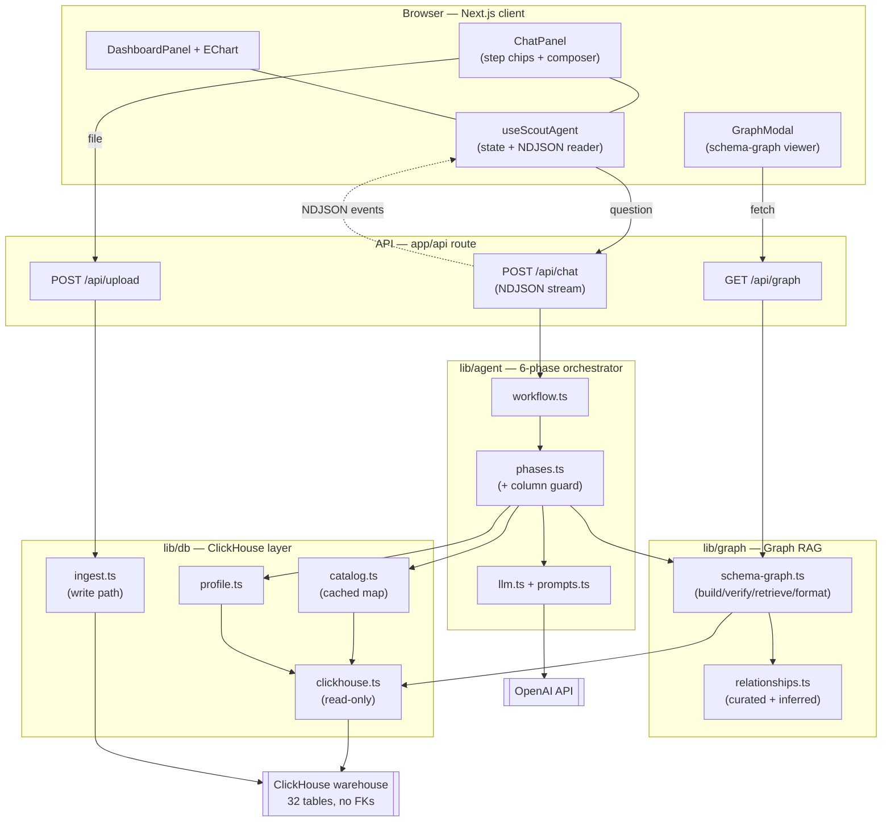
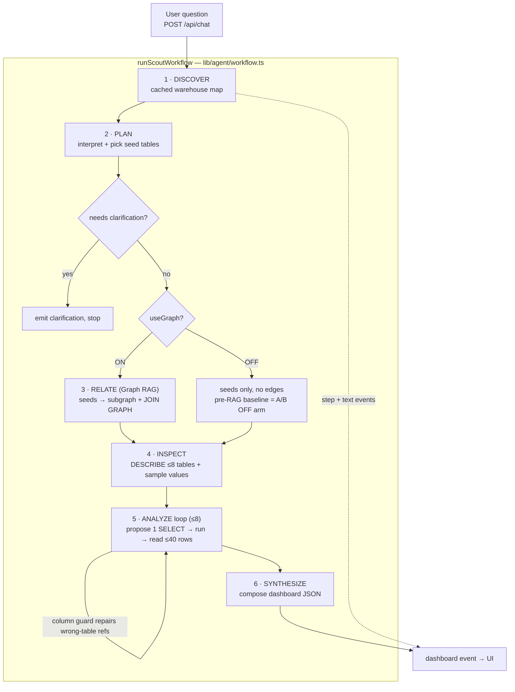
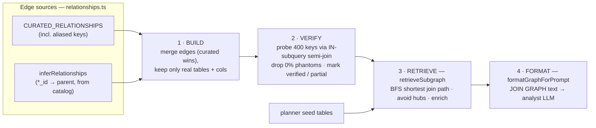

# Scout - AI Data Analytics Agent over ClickHouse

Scout turns a plain-English question into a structured analytical dashboard by reasoning over a large ClickHouse warehouse the way an analyst would:
map the schema, figure out which tables join and on what keys, write the SQL, run it,
and explain the result.

```
User question
   │  POST /api/chat  (streaming NDJSON)
   ▼
Scout pipeline    DISCOVER → PLAN → RELATE → INSPECT → ANALYZE↺ → SYNTHESIZE
   │                                └── Graph RAG: seed tables → connected subgraph + exact join keys
   ▼
Event stream  →  Chat panel (live reasoning chips + narrative)
              →  Dashboard panel (hero metrics, ECharts, insights, tables, Export SQL)
```

---

## Architecture & flow

**Agent architecture** — three library layers (`agent` / `graph` / `db`) behind a single streaming
API, with the UI importing only `lib/types.ts`:



**Program flow** — the six phases, the Graph-RAG ON/OFF switch (the A/B lever), and the bounded
analyze loop:



---

## 1. The problem this solves

The warehouse is **32 interconnected tables** modelling a card-issuer / retail bank (~7.3M rows),
and — by design — it has **no foreign keys**. ClickHouse has no FK constraints at all; tables are
linked only by *shared key columns*, and some of those keys are **aliased** (`loan_book.branch` →
`branches.branch_id`, `collections.assigned_employee_id` → `employees.employee_id`), so a column-name
match alone can't even find them.

A flat "here are all the tables, pick some" catalog works at 6 tables. At 32, a single business
question — *"which loan product recovered the most across collections?"* — routinely spans a join
chain the planner can't see in one shot, so the model guesses the join key and gets it wrong: it
answers from the wrong table, or writes SQL that ClickHouse rejects. **Graph RAG is what makes the
joins reliable.** Section 4 shows the measured before/after.

---

## 2. The warehouse

32 tables across eight sub-domains, linked by shared (often aliased) keys — never by FKs:

| Sub-domain | Tables |
|---|---|
| Customer | `customers`, `geographies`, `devices` |
| Branch & staff | `branches`, `employees` |
| Accounts & cards | `accounts`, `cards`, `card_products`, `card_applications`, `account_transactions` |
| Payments & rewards | `card_transactions`, `statements`, `rewards_ledger`, `reward_redemptions`, `offers`, `offer_redemptions` |
| Lending | `loan_book`, `loan_products`, `loan_applications`, `loan_repayments`, `collections`, `credit_bureau` |
| Risk & compliance | `disputes`, `fraud_alerts`, `kyc_records`, `aml_screenings` |
| Merchants | `merchants`, `merchant_categories` |
| Engagement | `app_sessions`, `support_tickets`, `marketing_campaigns`, `campaign_responses` |

The data is **internally consistent**, not random filler: `rewards_ledger` and `statements` are
derived from real `card_transactions`; `disputes`/`fraud_alerts` come from transactions actually
flagged `is_fraud`; `loan_repayments` is the real EMI schedule; `collections` exists only for
delinquent loans. Every row for a customer is generated from that customer's own
`value_band`/`credit_score`/`income`, so totals reconcile across tables. `npm run db:seed-graph`
builds it (idempotent).

---

## 3. Graph RAG, in detail

Classic RAG retrieves relevant *documents*. **Graph RAG retrieves a relevant *subgraph* of a
knowledge graph** — so the model gets the nodes **and the relationships between them**. Scout's
knowledge graph is the **schema graph**: *tables are nodes, recovered join keys are edges.* The
whole engine is [`lib/graph/schema-graph.ts`](lib/graph/schema-graph.ts) +
[`lib/graph/relationships.ts`](lib/graph/relationships.ts), in four stages:



### 3.1 Build — nodes and edges

- **Nodes** — every table in the live catalog (`system.columns`), carrying its column list and a
  free row-count estimate (`buildSchemaGraph`).
- **Edges** — the implicit join keys, recovered two ways and merged:
  - **Curated manifest** (`CURATED_RELATIONSHIPS`) — authoritative, hand-declared edges. This is the
    source of truth and captures the **aliased** keys a name match can't see (e.g.
    `card_transactions.merchant` → `merchants.merchant_name`).
  - **Auto-inference** (`inferRelationships`) — recovered purely from the catalog with zero FK
    metadata: any key-like column (`*_id`, or a known join column in `PARENT_OF_COLUMN`) that exists
    both on a table and on its **canonical parent** becomes an edge. This keeps the graph correct
    when **new tables are uploaded**, and proves relationships are discoverable with no FK metadata.

  `buildSchemaGraph()` merges both (**curated wins on conflict**) and every edge must exist in the
  live catalog — both tables present, both join columns real — defending against stale curation.

### 3.2 Verify — drop phantom joins against live data

A shared column name does **not** prove two columns join. `account_transactions.txn_id` and
`card_transactions.txn_id` share a name yet have **zero** overlapping values. So `verifyEdges()`
samples each child key (400 distinct values) and measures the fraction that actually resolves to the
parent — an `IN (subquery)` **semi-join**, *not* a `LEFT JOIN` (ClickHouse fills unmatched LEFT-JOIN
cells with type defaults, which would make every edge look like a 100% match). Edges at 0% overlap
are **dropped as phantoms**; the rest are marked `verified` (≥50%) or flagged **partial** so the
analyst is warned a join is lossy. It **fails open**: a probe timeout leaves an edge un-judged rather
than dropping a possibly-real key.

### 3.3 Retrieve — `retrieveSubgraph()`

The heart of it. Given the **seed tables** the planner picked from the question, it returns the
connected subgraph plus the exact join map:

1. **Keep the seeds.**
2. **Connect them** — for each remaining seed, find the shortest **join path** (fewest hops) to the
   already-included set with a breadth-first search (`bfsPath`), pulling in the **bridge tables**
   along the way. (A question spanning `customers` + `branches` automatically pulls in `accounts`.)
3. **Enrich** — fill the remaining budget (default 8 tables) with the seeds' direct neighbours,
   **verified edges first** (typically the dimension tables).

**Hub avoidance.** `customer_id` lives in ~24 tables and `city` is everywhere — they are **hub
columns**. If retrieval bridged through them, every question would drag the whole warehouse in
through `customers`. So traversal **avoids hub edges first** and only falls back to them when no
other path exists — a question about `disputes` reaches `card_transactions` directly instead of
detouring through the customer hub.

### 3.4 Inject — and repair the analyst's SQL

- `formatGraphForPrompt()` renders the subgraph as a **`JOIN GRAPH`** block of
  `tableA.colA = tableB.colB` lines, fed to the Analyst LLM with an instruction to join **only** on
  these recovered keys (partial edges are flagged as lossy).
- The graph is also **load-bearing at query time**, not just for retrieval. Because there are no FKs,
  the analyst sometimes references a column on a table that doesn't own it. `checkColumns()`
  (pre-flight) and `enrichColumnError()` (on a ClickHouse error) use the subgraph to tell it *which
  table owns the column and the exact join key to reach it* — so the retry is grounded instead of
  another guess.

### 3.5 Where it runs

```
DISCOVER → PLAN → [ RELATE ] → INSPECT → ANALYZE↺ → SYNTHESIZE
                      └── walks the graph from the planner's seeds → subgraph + JOIN GRAPH
```

The **RELATE** phase ([`lib/agent/phases.ts`](lib/agent/phases.ts)) sits between PLAN and INSPECT.
The change is **additive and safe**: if the graph is empty or the seeds are unreachable, RELATE falls
back to the seed tables and the pipeline behaves exactly as it did pre-Graph-RAG. That same fallback
is the OFF arm of the benchmark below.

You can see the exact graph the agent walks in the in-app **Schema Knowledge Graph** viewer (graph
icon, top of the chat panel), also served as JSON at `/api/graph`.

---

## 4. Does Graph RAG actually help? — verified results

Two independent kinds of evidence. The first is **deterministic and reproducible** (it doesn't depend
on LLM sampling); the second is an end-to-end A/B through the full agent.

### 4.1 The recovered graph is verified against live data

This is the core claim, and it is checkable with one request (`GET /api/graph`) — every edge is probed
against the live warehouse before it's trusted (Section 3.2). Measured on the live warehouse:

| Check | Result |
|---|---|
| Tables (nodes) | **32** |
| Join edges recovered | **63**, every one **verified against live data** (0 unverified, 0 phantom kept) |
| **Aliased** joins recovered — different column names, so a name-match heuristic *cannot* find them | `loan_book.branch = branches.branch_id` (100% overlap) · `support_tickets.assigned_employee_id = employees.employee_id` (100%) · `card_transactions.merchant = merchants.merchant_name` (100%) · `kyc_records.verified_by_employee_id = employees.employee_id` (94%) |
| **Phantom** join dropped — same column name, but the values never join | `account_transactions.txn_id ↔ card_transactions.txn_id` measured at **0% overlap → dropped** |
| Real edges (sanity) | `collections.loan_id → loan_book.loan_id` = 100% · `fraud_alerts.txn_id → card_transactions.txn_id` = 100% |

The phantom case is the sharpest illustration: two `txn_id` columns share a name but belong to
different transaction systems, so they have **zero** overlapping values — a name-match would create a
join that silently returns nothing. Scout's verification catches and drops it. The aliased cases are
the opposite: the columns have *different* names but really do join (100%), and only the curated graph
recovers them. This is exactly the join information a flat table catalog cannot give the model.

### 4.2 End-to-end A/B — graph ON vs OFF through the full agent

`npm run db:eval` ([`scripts/eval_graph.mjs`](scripts/eval_graph.mjs)) runs the full agent twice per
question — graph **OFF** (`{graph:false}`, the pre-Graph-RAG fallback that hands the analyst the raw
seed tables with no join graph) vs **ON** — over **9 multi-table questions** (each requiring a no-FK
join) plus **2 single-table controls**. Ground truth for every question is computed live from
ClickHouse with a known-correct query (never hardcoded), and scoring is applied identically to both
arms, so the comparison is fair.

Averaged over **5 full `npm run db:eval` passes** (55 question-runs per arm):

| Signal (mean of 5 runs) | Graph OFF | Graph ON |
|---|---|---|
| Answer accuracy — all 11 questions | 51% (28/55) | 53% (29/55) |
| Answer accuracy — 9 join questions only | 40% (18/45) | 42% (19/45) |
| Wrong-table / wrong-key SQL rejected by ClickHouse | **2.6 / run** (13 total) | **0.6 / run** (3 total) |
| Run-to-run accuracy spread (std dev, all questions) | ±12.7 pts | ±4.0 pts |
| Completed with a dashboard | 100% | 100% |

**The honest reading (5-run average).** On *final-answer accuracy* the two arms are **~parity** — graph
ON 53% vs OFF 51% overall (42% vs 40% on the join questions). That gap is within run-to-run sampling
noise (OFF alone swung from 36% to 64% across the five passes), so we make **no "accuracy went up X%"
claim**. Graph RAG's real, repeatable gain is **robustness**: it cut wrong-table / wrong-key SQL errors
from **2.6 to 0.6 per run** (ON hit zero in 3 of the 5 passes) and made outcomes **~3× more consistent**
(±4 vs ±13 points of run-to-run spread). Most of these joins are simple enough that the planner already
seeds both tables and the analyst joins them without help, so accuracy is dominated by LLM sampling,
not the graph. Where the planner *can't* see the path — the multi-hop chains and the aliased keys in
§4.1 — the graph is what makes the join possible at all. (A few questions, e.g. "most fraud alerts",
are missed by *both* arms: those are aggregation/interpretation errors the graph does not address — it
fixes joins, not analytical reasoning.)

> The numbers above are the **mean of 5 full `npm run db:eval` passes**. Re-run it (or
> `npm run db:eval -- 1 4` for a chunk) for a fresh measurement; the end-to-end numbers vary
> run-to-run — hence the average — while the §4.1 graph verification is deterministic.

---

## 5. The 6-phase pipeline

Instead of one unconstrained tool-calling loop, Scout decomposes analysis into six typed phases
(orchestrated in [`lib/agent/workflow.ts`](lib/agent/workflow.ts), one function each in
[`lib/agent/phases.ts`](lib/agent/phases.ts)):

1. **DISCOVER** — map the warehouse once (cached): tables, columns, free row-count estimates.
2. **PLAN** — the Planner LLM interprets the (often vague) question, fixes metric definitions, picks
   seed tables, and decides if it must ask for clarification.
3. **RELATE (Graph RAG)** — walk the schema graph from the seeds to the connected subgraph + exact
   join keys (Section 3).
4. **INSPECT** — fetch exact typed schemas (`DESCRIBE`) for the subgraph's tables (up to 8).
5. **ANALYZE** — a bounded loop (≤ 8 queries): the Analyst LLM, armed with the `JOIN GRAPH` and
   sampled categorical values, proposes one SELECT, runs it, reads ≤ 40 result rows, and iterates.
   The graph-backed column guard repairs wrong-table references here.
6. **SYNTHESIZE** — the Synthesizer LLM composes the structured JSON dashboard, using exact
   warehouse facts (table/row counts) so it never guesses structural numbers.

Every phase streams its own step chip to the UI, so the user watches the reasoning live.

---

## 6. ClickHouse engineering

ClickHouse is a column-oriented DBMS built for sub-second aggregation over billions of rows; Scout
leans on that fully:

- **Server-side aggregation.** All maths runs in ClickHouse. The LLM only ever sees ≤ 40-row result
  previews, keeping tokens low and latency down.
- **Read-only by policy.** The analytics path may only run `SELECT`/`DESCRIBE`/`SHOW`
  (`assertReadOnly` in [`lib/db/clickhouse.ts`](lib/db/clickhouse.ts)); the one write path is gated
  file ingestion ([`lib/db/ingest.ts`](lib/db/ingest.ts)).
- **Type inference on upload** ([`lib/db/parsers.ts`](lib/db/parsers.ts)): identifier-like columns
  stay `String`; repetitive text becomes `LowCardinality(String)` (dictionary-compressed, faster
  `GROUP BY`); money becomes `Decimal(18,4)` (no float rounding); dates/datetimes are detected. The
  `MergeTree ORDER BY` key is chosen from low-cardinality columns for index efficiency.
- **Catalog cached once.** The warehouse map (and the schema graph built on top of it) is discovered
  a single time and reused across follow-up questions; invalidated automatically after an upload.

---

## 7. Quick start

```bash
# 1. Install
npm install

# 2. Configure env
cp .env.example .env
#   OPENAI_API_KEY, OPENAI_MODEL (gpt-4o)
#   CLICKHOUSE_HOST / USER / PASSWORD / DATABASE

# 3. (optional) build the 32-table demo warehouse
npm run db:seed-graph

# 4. Run
npm run dev          # http://localhost:3000
```

### Dev & evaluation utilities

```bash
npm run db:tables      # list every table with column + row counts
npm run db:peek        # browse a table's data:  npm run db:peek -- <table> [limit]
npm run db:seed-graph  # (re)generate the interconnected no-FK warehouse (idempotent)
npm run db:eval        # the Graph-RAG A/B benchmark (needs the dev server; uses paid LLM calls)
```

### Deploy (Railway)

Link the repo, set `OPENAI_API_KEY`, `OPENAI_MODEL`, and `CLICKHOUSE_HOST/USER/PASSWORD/DATABASE`
under **Variables**. Railway auto-detects Next.js via Nixpacks, runs `npm run build`, and starts with
`npm run start` on `$PORT`.

---

## 8. Project structure

The three concerns are separated by folder. The **UI** (`app/*.tsx`, `components/`, `hooks/`) imports
only `lib/types.ts`; the **agent** lives in `lib/agent/`; the **graph** in `lib/graph/`; the
**ClickHouse data layer** in `lib/db/`.

```
app/
  page.tsx                 UI shell (state lives in hooks/useScoutAgent.ts)
  api/[[...route]]/route.ts API router: /api/chat (stream), /api/upload, /api/db-info, /api/graph
  health/route.ts          liveness probe
components/                ChatPanel, DashboardPanel + EChart, GraphModal (graph viewer), icons
  components.css           all hand-written component styles (the rest is Tailwind utilities)
hooks/useScoutAgent.ts     client state: turns, dashboard versions, streaming, upload
lib/
  types.ts                 shared contract: streaming events + dashboard shape
  agent/
    workflow.ts            the 6-phase orchestrator (+ the graph ON/OFF switch)
    phases.ts              the six phases + the graph-backed column guard + dashboard coercion
    context.ts             shared shapes (Plan/AnalyzeResult) + prompt formatters
    prompts.ts             all LLM system prompts
    llm.ts                 OpenAI client wrapper (llmJSON)
  graph/                   ── GRAPH RAG ──
    relationships.ts       recovers implicit join edges (curated manifest + auto-inference, no FKs)
    schema-graph.ts        build → verify → retrieveSubgraph → formatGraphForPrompt
  db/                      ── CLICKHOUSE ──
    clickhouse.ts          read-only query layer (runSelect / describeTable)
    catalog.ts             cached warehouse catalog
    parsers.ts             CSV/TSV/JSON/Excel parsing + schema inference
    ingest.ts              the one write path: CREATE TABLE + bulk INSERT
    profile.ts             samples categorical column values for the analyst
scripts/
  seed_graph.mjs           generates the interconnected no-FK warehouse
  eval_graph.mjs           the Graph-RAG A/B benchmark (Section 4)
  ch_tables.mjs / peek.sh  warehouse inspection helpers
```

---

## 9. Features & limits

- **Conversational analysis** with live streamed reasoning steps and **follow-ups** that build on
  context (*"now filter that to Mumbai"*).
- **Structured dashboards**: hero metrics, ECharts charts each with a written insight, tables, and
  recommendations. **Export SQL** exposes every query the agent ran.
- **File upload** (CSV / Excel / JSON): Scout infers a ClickHouse schema, creates the table, loads
  the rows, and the graph's auto-inference wires the new table into the join graph.
- **Scope:** the agent caps itself at ~8 queries per analysis; the graph's edge-verification probes
  are sampled (400 keys) and cached, so they stay cheap on multi-million-row tables.
