# Scout - AI Data Analytics Agent over ClickHouse

Scout is an analytics agent that sits on top of **your ClickHouse warehouse** and
answers open-ended business questions in plain English. It works the way a senior analyst would:
**map the schema, work out which tables join and on what keys, write the SQL, run it, and explain
the result**, all at runtime, streamed live to a dashboard.

```text
 Question ──▶ POST /api/chat ──▶  DISCOVER → PLAN → RELATE → INSPECT → ANALYZE↺ → SYNTHESIZE
   (NL)         (NDJSON stream)                   └── Graph RAG: seeds → connected subgraph + exact join keys
                     │
                     ├──▶ Chat panel .......... live reasoning chips + narrative
                     └──▶ Dashboard panel ..... hero metrics · ECharts · insights · Export SQL
```

Built for data and analytics teams in **banking, fintech, and any organization running large
analytical warehouses**: portfolio analysts, risk and collections teams, BI engineers, and anyone
who wants answers from crore-row tables without writing SQL by hand.

---

## Screenshots

<table>
  <tr>
    <td width="50%" align="center" valign="top">
      <b>Ask in plain English, get a complete dashboard</b><br/><br/>
      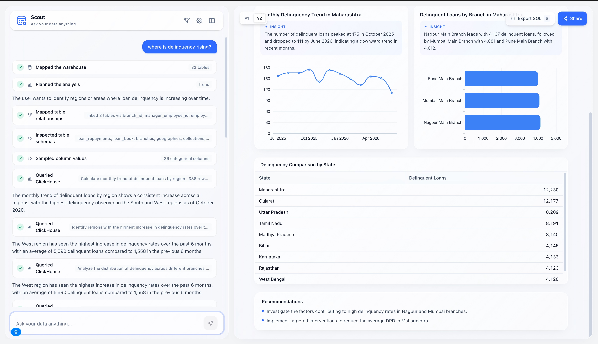
    </td>
    <td width="50%" align="center" valign="top">
      <b>Multi-turn follow-ups with versioned dashboards</b><br/><br/>
      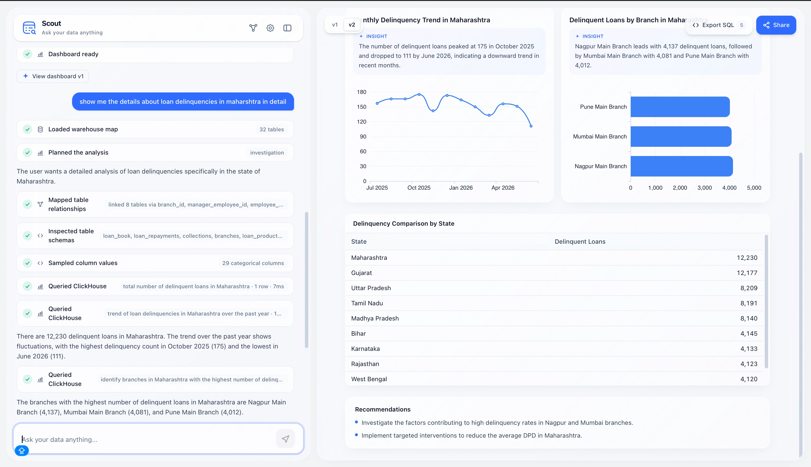
    </td>
  </tr>
  <tr>
    <td width="50%" align="center" valign="top">
      <b>Hero metrics, ECharts, and written insights</b><br/><br/>
      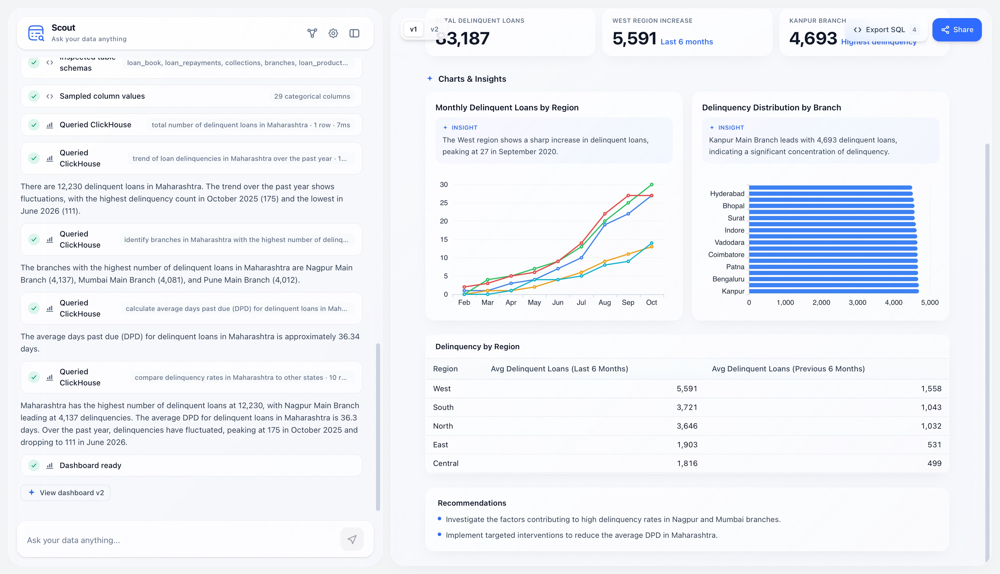
    </td>
    <td width="50%" align="center" valign="top">
      <b>Export the exact SQL behind every answer</b><br/><br/>
      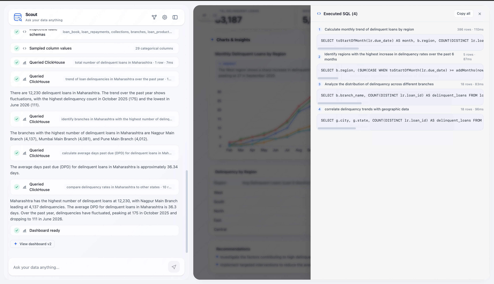
    </td>
  </tr>
  <tr>
    <td width="50%" align="center" valign="top">
      <b>Share any analysis as a portable Markdown report</b><br/><br/>
      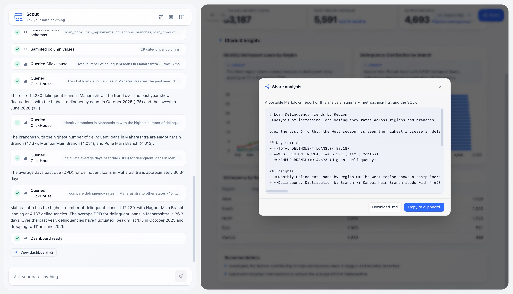
    </td>
    <td width="50%" align="center" valign="top">
      <b>Graph RAG Lab — visualize the recovered schema graph</b><br/><br/>
      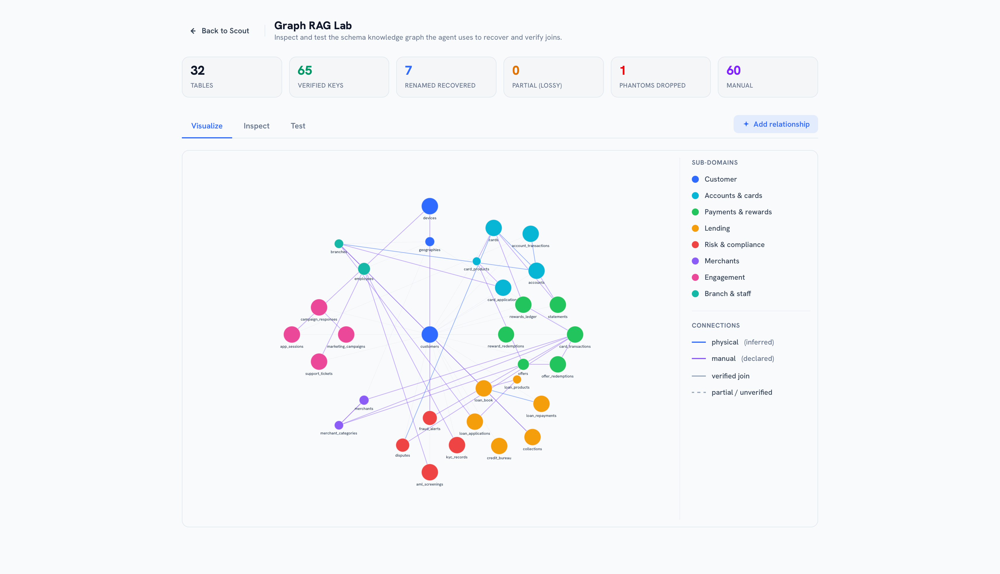
    </td>
  </tr>
  <tr>
    <td width="50%" align="center" valign="top">
      <b>Inspect every join key with live overlap and verdict</b><br/><br/>
      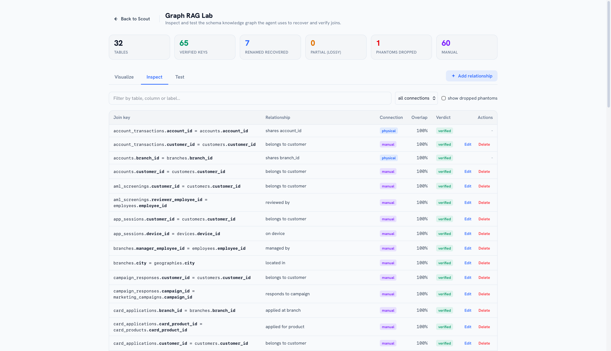
    </td>
    <td width="50%" align="center" valign="top">
      <b>Test retrieval and probe any two columns</b><br/><br/>
      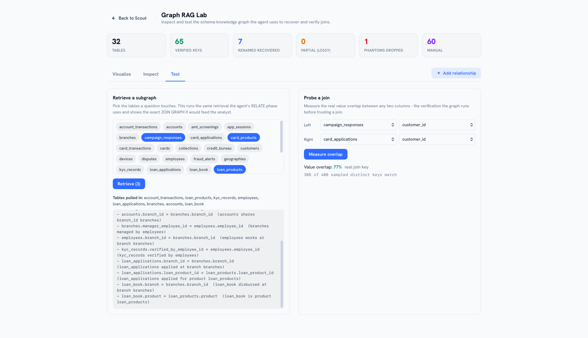
    </td>
  </tr>
</table>

---

## Features

- **Plain-English questions, complete dashboards.** Ask "where is delinquency rising?" or "which
  card product is declining, and since when?" and get an executive summary, 3-4 hero metrics,
  ECharts visualizations with written insights, detail tables, and recommendations in one pass.
- **Transparent reasoning, live.** Every phase streams a step chip to the chat as it runs
  (mapping the warehouse, walking the schema graph, each SQL query with row counts and timing),
  so users see exactly how an answer was produced instead of trusting a black box.
- **Works on warehouses with no foreign keys.** Real analytical warehouses rarely declare FKs.
  Scout's Graph RAG engine recovers join keys from the schema and **verifies every edge against
  live data**, dropping phantom joins (same column name, zero overlapping values) and flagging
  lossy ones, so multi-table answers join on keys that actually resolve.
- **Read-only by design, safe on production data.** A statement allowlist (SELECT / DESCRIBE /
  SHOW / EXPLAIN only, no stacked statements) plus ClickHouse `readonly=2` at the session level
  mean the agent can never mutate your warehouse, no matter what the model proposes.
- **Built for scale.** All aggregation is pushed down into ClickHouse; the agent only ever reads
  small aggregated result sets. Schema discovery, the join graph, and column-value profiles are
  cached, so a question costs queries, not warehouse scans.
- **Self-correcting SQL.** A graph-backed column guard catches wrong-table column references
  before they run, and ClickHouse errors are enriched with the table that actually owns the
  column plus the exact join key to reach it, so retries are grounded rather than guesses.
- **The Graph RAG Lab.** An in-app workbench (`/graph`) to visualize the recovered schema graph,
  inspect every join key with its live overlap and verdict, test retrieval, probe any two columns,
  and declare the aliased relationships automatic inference can't see.
- **Simple to operate.** One Node.js service, five environment variables, a `/health` liveness
  endpoint, and a streaming NDJSON API. Deploys anywhere Node runs.

---

## Quickstart: connect your ClickHouse and run

### 1. Prerequisites

- **Node.js 18.18+** (20+ recommended)
- A **ClickHouse** instance you can reach over HTTP(S): ClickHouse Cloud or self-hosted, with
  the database you want to analyze already populated
- An **OpenAI API key**

### 2. Install

```bash
git clone https://github.com/Arav-Arun/Scout.git
cd Scout
npm install
```

### 3. Configure the connection

```bash
cp .env.example .env
```

Fill in `.env`:

| Variable              | What to put there                                                                                              |
| --------------------- | -------------------------------------------------------------------------------------------------------------- |
| `CLICKHOUSE_HOST`     | Full HTTP(S) URL incl. port, e.g. `https://your-instance.region.aws.clickhouse.cloud:8443` or `http://localhost:8123` |
| `CLICKHOUSE_USER`     | ClickHouse user (a read-only user is enough for analysis)                                                        |
| `CLICKHOUSE_PASSWORD` | That user's password                                                                                             |
| `CLICKHOUSE_DATABASE` | The database Scout should analyze (defaults to `default`)                                                        |
| `OPENAI_API_KEY`      | Powers the planner / analyst / synthesizer LLM calls                                                             |
| `OPENAI_MODEL`        | Optional. Defaults to `gpt-4o`                                                                                   |

**Permissions:** Scout only ever runs `SELECT` against your data, enforced in code and at the
session level. Granting the user `CREATE` / `INSERT` on the configured database is optional: it
lets Scout persist its schema-graph snapshot and your manually declared relationships in three
small bookkeeping tables (`scout_schema_graph_edges`, `scout_schema_graph_nodes`,
`scout_user_edges`). With a strictly read-only user, analysis still works end to end; the graph
is simply kept in memory and manual edges can't be saved.

### 4. Run

```bash
npm run dev        # development, http://localhost:3000
```

```bash
npm run build      # production
npm start
```

Open the app, and ask a question. Scout discovers your schema on the first question and caches
it; no schema registration, config files, or annotations are needed.

**Note for ClickHouse Cloud:** if your instance idles, the very first question after a quiet
period can take extra time while the instance wakes. Subsequent questions are fast.

### 5. Deploy

Scout is a standard Next.js app and runs on any Node host (it is deployed on Railway in
production). Set the same environment variables on the host. `GET /health` is provided as a
liveness probe. On serverless platforms, note that an analysis streams for up to a few minutes;
the API route declares `maxDuration = 300`.

---

## Using Scout

- **Ask anything, vague is fine.** The planner interprets open-ended questions ("what's trending
  up this quarter?"), states its assumptions, and only asks a clarifying question when a wrong
  guess would genuinely mislead.
- **Follow up naturally.** "Now break that down by branch" builds on the previous answer's
  context. Each answer becomes a new dashboard version (v1, v2, ...) you can flip between.
- **Audit every answer.** "Export SQL" shows each query the agent ran, with its purpose, row
  count, and timing. "Share" produces a portable Markdown report of the analysis.
- **Teach it your joins.** Open the Graph RAG Lab (graph icon in the header) to see the join
  graph Scout recovered. If two columns relate under different names (e.g.
  `card_transactions.merchant` joins `merchants.merchant_name`), declare that edge once in the
  Lab: it is verified against your live data on the spot, persisted, and used by every question
  from then on.

---

## Architecture

Three library layers - **`agent` / `graph` / `db`** - sit behind a single streaming API. The UI
imports only `lib/types.ts`; each layer talks only to the one below it.

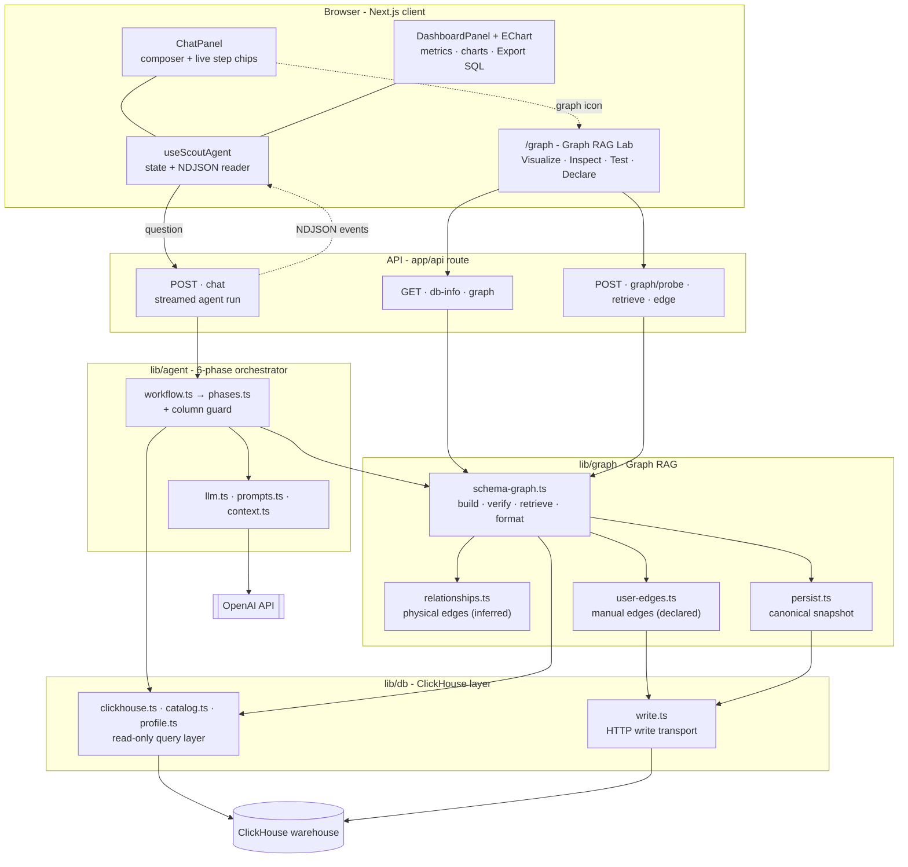
```mermaid
flowchart TB
  subgraph UI["Browser - Next.js client"]
    HOOK["useScoutAgent<br/>state + NDJSON reader"]
    CHAT["ChatPanel<br/>composer + live step chips"]
    DASH["DashboardPanel + EChart<br/>metrics · charts · Export SQL"]
    LAB["/graph - Graph RAG Lab<br/>Visualize · Inspect · Test · Declare"]
  end

  subgraph API["API - app/api route"]
    GET["GET · db-info · graph"]
    CHATAPI["POST · chat<br/>streamed agent run"]
    EDGEAPI["POST · graph/probe · retrieve · edge"]
  end

  subgraph AGENT["lib/agent - 6-phase orchestrator"]
    WF["workflow.ts → phases.ts<br/>+ column guard"]
    LLM["llm.ts · prompts.ts · context.ts"]
  end

  subgraph GRAPH["lib/graph - Graph RAG"]
    SG["schema-graph.ts<br/>build · verify · retrieve · format"]
    REL["relationships.ts<br/>physical edges (inferred)"]
    UE["user-edges.ts<br/>manual edges (declared)"]
    PERSIST["persist.ts<br/>canonical snapshot"]
  end

  subgraph DB["lib/db - ClickHouse layer"]
    CH["clickhouse.ts · catalog.ts · profile.ts<br/>read-only query layer"]
    WRITE["write.ts<br/>HTTP write transport"]
  end

  OPENAI[["OpenAI API"]]
  WARE[("ClickHouse warehouse")]

  CHAT --- HOOK
  DASH --- HOOK
  HOOK -->|question| CHATAPI
  CHAT -. graph icon .-> LAB
  LAB --> GET
  LAB --> EDGEAPI

  CHATAPI --> WF
  WF --> LLM --> OPENAI
  WF --> SG
  GET --> SG
  EDGEAPI --> SG
  SG --> REL
  SG --> UE
  SG --> PERSIST
  WF --> CH
  SG --> CH
  UE --> WRITE
  PERSIST --> WRITE
  CH --> WARE
  WRITE --> WARE
  CHATAPI -. NDJSON events .-> HOOK
```

**Request lifecycle** - the six phases and the bounded analyze loop:

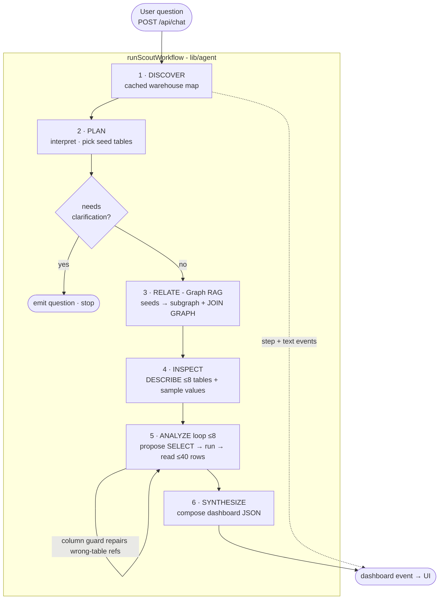
```mermaid
flowchart TD
  Q(["User question<br/>POST /api/chat"]) --> D

  subgraph PIPE["runScoutWorkflow - lib/agent"]
    D["1 · DISCOVER<br/>cached warehouse map"] --> P
    P["2 · PLAN<br/>interpret · pick seed tables"] --> CL{"needs<br/>clarification?"}
    CL -->|yes| STOP(["emit question · stop"])
    CL -->|no| R["3 · RELATE - Graph RAG<br/>seeds → subgraph + JOIN GRAPH"]
    R --> I["4 · INSPECT<br/>DESCRIBE ≤8 tables + sample values"]
    I --> A["5 · ANALYZE loop ≤8<br/>propose SELECT → run → read ≤40 rows"]
    A -->|column guard repairs wrong-table refs| A
    A --> S["6 · SYNTHESIZE<br/>compose dashboard JSON"]
  end

  S --> OUT(["dashboard event → UI"])
  D -. step + text events .-> OUT
```

---

## 1 · The problem this solves

Analytical warehouses rarely declare foreign keys, and column names lie in both directions. The
reference warehouse Scout was built and tested against models a card issuer / retail bank in
**32 interconnected tables (~7.3M rows)** with, by design, **no foreign keys**. Tables are linked
only by _shared key columns_, and some of those keys are **aliased**, so a column-name match
alone can't even find them:

| Child column                       | actually joins | Parent column             |
| ---------------------------------- | -------------- | ------------------------- |
| `loan_book.branch`                 | →              | `branches.branch_id`      |
| `collections.assigned_employee_id` | →              | `employees.employee_id`   |
| `card_transactions.merchant`       | →              | `merchants.merchant_name` |

A shared _name_, meanwhile, doesn't prove a join either: `account_transactions.txn_id` and
`card_transactions.txn_id` share a name but have **zero** overlapping values. Scout has to tell
the real relationships from the coincidental ones from the data, not the schema.

## 2 · The reference warehouse

32 tables across eight sub-domains, linked by shared (often aliased) keys, never by FKs:

| Sub-domain         | Tables                                                                                                   |
| ------------------ | -------------------------------------------------------------------------------------------------------- |
| Customer           | `customers`, `geographies`, `devices`                                                                    |
| Branch & staff     | `branches`, `employees`                                                                                  |
| Accounts & cards   | `accounts`, `cards`, `card_products`, `card_applications`, `account_transactions`                        |
| Payments & rewards | `card_transactions`, `statements`, `rewards_ledger`, `reward_redemptions`, `offers`, `offer_redemptions` |
| Lending            | `loan_book`, `loan_products`, `loan_applications`, `loan_repayments`, `collections`, `credit_bureau`     |
| Risk & compliance  | `disputes`, `fraud_alerts`, `kyc_records`, `aml_screenings`                                              |
| Merchants          | `merchants`, `merchant_categories`                                                                       |
| Engagement         | `app_sessions`, `support_tickets`, `marketing_campaigns`, `campaign_responses`                           |

Scout is not tied to this schema: point it at any populated ClickHouse database and it discovers
the catalog, recovers the join graph, and answers from there.

---

## 3 · Graph RAG, in detail

Classic RAG retrieves relevant _documents_. **Graph RAG retrieves a relevant _subgraph_**: the
nodes _and_ the relationships between them. Scout's knowledge graph is the **schema graph**:
tables are nodes, recovered join keys are edges. The engine is
[`lib/graph/schema-graph.ts`](lib/graph/schema-graph.ts) +
[`lib/graph/relationships.ts`](lib/graph/relationships.ts).

The expensive part, assembling every candidate edge and probing each one against the live data,
runs **once** and is stored as a single canonical graph. Every conversation and the in-app viewer
then **read** that stored graph; they never re-verify. Verification only re-runs when a human
changes the graph in the Lab.

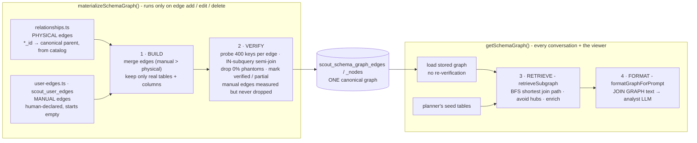
```mermaid
flowchart LR
  subgraph WRITE["materializeSchemaGraph() - runs only on edge add / edit / delete"]
    direction TB
    INF["relationships.ts<br/>PHYSICAL edges<br/>*_id → canonical parent, from catalog"]
    MAN["user-edges.ts · scout_user_edges<br/>MANUAL edges<br/>human-declared, starts empty"]
    INF --> B
    MAN --> B
    B["1 · BUILD<br/>merge edges (manual > physical)<br/>keep only real tables + columns"] --> V
    V["2 · VERIFY<br/>probe 400 keys per edge · IN-subquery semi-join<br/>drop 0% phantoms · mark verified / partial<br/>manual edges measured but never dropped"]
  end

  V --> STORE[("scout_schema_graph_edges / _nodes<br/>ONE canonical graph")]

  subgraph READ["getSchemaGraph() - every conversation + the viewer"]
    direction TB
    LOAD["load stored graph<br/>no re-verification"] --> RET
    SEEDS["planner's seed tables"] --> RET
    RET["3 · RETRIEVE - retrieveSubgraph<br/>BFS shortest join path · avoid hubs · enrich"] --> FMT
    FMT["4 · FORMAT - formatGraphForPrompt<br/>JOIN GRAPH text → analyst LLM"]
  end

  STORE --> LOAD
```

### 3.1 Two kinds of edge

The graph has no FK metadata to start from, so every edge comes from one of two sources surfaced
in the UI as its **connection** kind:

- **Physical** _(inferred)_ - recovered purely from the catalog: any key-like column (`*_id`, or a
  known join column in `PARENT_OF_COLUMN`) that exists both on a table and on its **canonical
  parent** becomes an edge. Zero configuration, recomputed from the live schema, so it stays
  correct as tables change. This is the automatic backbone of the graph.
- **Manual** _(declared)_ - human-asserted edges managed in the **Graph RAG Lab** and stored in
  `scout_user_edges`. The store **starts empty**; you declare the edges inference can't see -
  the **aliased** keys (`card_transactions.merchant → merchants.merchant_name`) - and they become
  first-class, editable join keys. Manual is authoritative: on conflict it **wins over** physical.

`buildSchemaGraph()` merges both and requires every edge to exist in the live catalog.

### 3.2 Verify - drop phantom joins against live data

A shared column name doesn't prove a join, so `verifyEdges()` **measures** each edge: it samples
the child key (400 distinct values) and counts the fraction that actually resolve to the parent,
using an `IN (subquery)` **semi-join** (not a `LEFT JOIN`, which ClickHouse fills with type
defaults and would make every edge look like a 100% match).

- **0% overlap → dropped** as a confirmed phantom (kept aside for inspection, never traversed).
- **≥ 50% → `verified`**; anything in between is flagged **`partial`** so the analyst is warned
  the join is lossy.
- The count is **auditable**: `measureOverlap` returns the exact `matched` / `sampled` behind the
  percentage, surfaced in the Lab.
- It **fails open**: a probe timeout leaves an edge un-judged rather than dropping a
  possibly-real key. **Manual** edges are measured the same way but **never dropped** (a human
  asserted them; a lossy one is still flagged partial).

The verified graph is persisted by [`lib/graph/persist.ts`](lib/graph/persist.ts) to
`scout_schema_graph_edges` / `_nodes` as **exactly one** snapshot (each materialization writes a
fresh `built_at` and prunes the older one). `loadStoredGraph()` reads it straight back - that's
what `getSchemaGraph()` serves, so the build/verify cost is paid once, not per question.

### 3.3 Retrieve - `retrieveSubgraph()`

Given the **seed tables** the planner picked, it returns the connected subgraph plus the exact
join map:

1. **Keep the seeds.**
2. **Connect them** - for each remaining seed, find the shortest **join path** (fewest hops) to
   the already-included set with a breadth-first search, pulling in the **bridge tables** along
   the way. (A question spanning `customers` + `branches` automatically pulls in `accounts`.)
   Hub columns (`customer_id`, `city`) are avoided first, so two unrelated tables aren't bridged
   just because both carry a hub column.
3. **Enrich** - fill the remaining budget (default 8 tables) with the seeds' direct neighbours,
   **verified edges first** (typically the dimension tables).

### 3.4 Inject - and repair the analyst's SQL

- `formatGraphForPrompt()` renders the subgraph as a **`JOIN GRAPH`** block of
  `tableA.colA = tableB.colB` lines, fed to the Analyst LLM with an instruction to join **only**
  on these recovered keys (partial edges flagged as lossy).
- The graph is **load-bearing at query time**, not just for retrieval. Because there are no FKs,
  the analyst sometimes references a column on a table that doesn't own it. `checkColumns()`
  (pre-flight) and `enrichError()` (on a ClickHouse error) use the subgraph to tell it _which
  table owns the column and the exact join key to reach it_ so the retry is grounded, not another
  guess. `enrichError()` also catches an **unknown-table** reference (a name the model invented):
  it names the real tables and the closest match, so the agent reports clearly instead of failing
  cryptically.

### 3.5 The Graph RAG Lab (`/graph`)

- **Visualize** - the schema graph as nodes (tables, coloured by sub-domain) and edges
  (verified / partial / physical / manual).
- **Inspect** - every recovered edge with its **connection** (physical / manual), live value
  overlap, and verdict (verified / partial / dropped phantom), including the dropped phantoms.
- **Test** - pick seed tables and see the exact subgraph + `JOIN GRAPH` the RELATE phase would
  build, or probe any two columns for their live overlap (with exact matched / sampled counts).
- **Declare a relationship** - add, edit, or delete a **manual** edge between two related
  columns. Each change is verified against live data, persisted to `scout_user_edges`,
  re-materializes the canonical graph, and shows up in the next question immediately.

---

## 4 · The 6-phase pipeline

Instead of one unconstrained tool-calling loop, Scout decomposes analysis into six typed phases
(orchestrated in [`lib/agent/workflow.ts`](lib/agent/workflow.ts), one function each in
[`lib/agent/phases.ts`](lib/agent/phases.ts)):

1. **DISCOVER** - map the warehouse once (cached): tables, columns, free row-count estimates.
2. **PLAN** - the Planner LLM interprets the question, fixes metric definitions, picks seed
   tables, and decides whether to ask for clarification.
3. **RELATE (Graph RAG)** - read the schema graph and walk from the seeds to the connected
   subgraph + exact join keys (Section 3). Degrades to just the seeds if the graph is
   unavailable.
4. **INSPECT** - fetch exact typed schemas (`DESCRIBE`) for the subgraph's tables (up to 8) and
   sample their categorical values.
5. **ANALYZE** - a bounded loop (≤ 8 queries): the Analyst LLM, armed with the `JOIN GRAPH` and
   the sampled values, proposes one SELECT, runs it, reads ≤ 40 result rows, and iterates. The
   graph-backed column guard repairs wrong-table references here.
6. **SYNTHESIZE** - the Synthesizer LLM composes the structured JSON dashboard, using exact
   warehouse facts (table / row counts) so it never guesses structural numbers.

Every phase streams its own step chip to the UI, so the user watches the reasoning live.

---

## 5 · Project structure

```text
app/
  page.tsx                    UI shell (state lives in hooks/useScoutAgent.ts)
  graph/page.tsx              Graph RAG Lab (Visualize / Inspect / Test / Declare)
  health/route.ts             GET /health liveness probe
  api/[[...route]]/route.ts   API router: GET db-info · graph ; POST chat · graph/probe·retrieve·edge
components/                   ChatPanel · DashboardPanel + EChart · GraphCanvas (SVG graph viewer) · icons
  components.css              hand-written component styles (the rest is Tailwind utilities)
hooks/useScoutAgent.ts        client state: turns, dashboard versions, NDJSON streaming
lib/
  types.ts                    shared contract: streaming events + dashboard shape
  agent/                      ── AGENT ──
    workflow.ts               the 6-phase orchestrator
    phases.ts                 the six phases + the graph-backed column guard + dashboard coercion
    context.ts                shared shapes (Plan / AnalyzeResult) + prompt formatters
    prompts.ts                all LLM system prompts
    llm.ts                    OpenAI client wrapper (llmJSON)
  graph/                      ── GRAPH RAG ──
    relationships.ts          physical (inferred) edges + hub/parent/domain metadata
    user-edges.ts             manual (declared) edge store: scout_user_edges
    schema-graph.ts           materialize (build → verify → persist) · get (read) · retrieve · format
    persist.ts                single canonical graph snapshot → scout_schema_graph_edges/_nodes
  db/                         ── CLICKHOUSE ──
    clickhouse.ts             read-only query layer (runSelect / describeTable)
    catalog.ts                cached warehouse catalog
    profile.ts                samples categorical column values for the analyst
    write.ts                  HTTP write transport (chExec) for the manual store + graph snapshot
```
